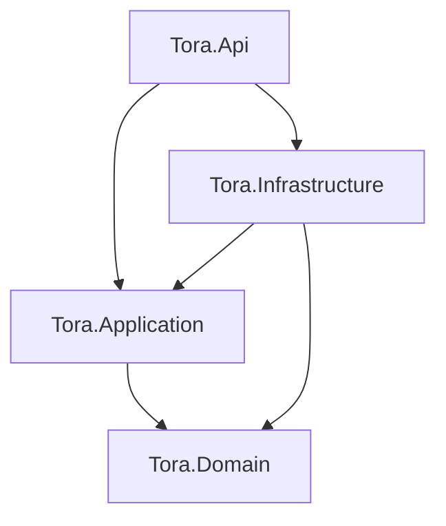

# Tora
## what it is
Tora is a role-based project and task management REST API built with .NET 9 and Clean Architecture. It supports JWT authentication with refresh token rotation, role-based access control (SuperAdmin, Manager, Developer, Guest), and is structured using CQRS with MediatR.
## Architecture Diagram 

## Tech Stack


## How to run it locally
git clone https://github.com/seiryuu002/Tora
cd Tora
dotnet restore
dotnet run --project src/Tora.Api

## Api Endpoints
1. To register as a user (only SuperAdmin can register users)
   ``` POST  http://localhost:5124/tora/Auth/register HTTP/1.1 ```
2. For logging in
   ``` POST (http://localhost:5124/tora/Auth/login HTTP/1.1) ```
3. To get a new refresh token
   ``` POST  http://localhost:5124/tora/Auth/refresh HTTP/1.1 ```
4. To fetch user data
   ``` GET http://localhost:5124/tora/User?&Page=1&PageSize=10 HTTP/1.1 ```
   
## future scope and plan
1. Unit and integration tests (xUnit + Moq)
2. Docker + CI/CD pipeline
3. Deploy to Railway
4. Project and Task CRUD endpoints

